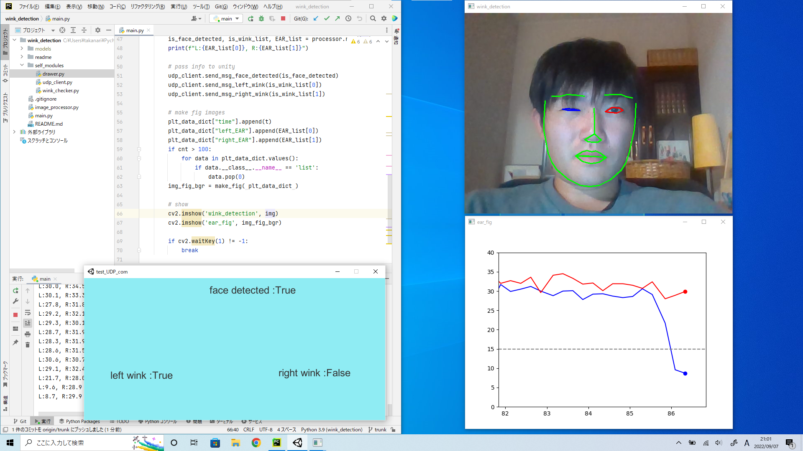

# Install 
## Install VisualStudio BuildTool
* Download buildtool.exe and install with ✓ C++ Environment  
https://visualstudio.microsoft.com/ja/downloads/#build-tools-for-visual-studio-2022

* Add PATH for compiler (cl.exe)  
C:\Program Files (x86)\Microsoft Visual Studio\2022\BuildTools\VC\Tools\MSVC\x.x.x\bin\Hostx64\x64

* Add LIB, INCLUDE, LIBPATH  
open x64 native tools command prompt VS 2022  
run below command and paste  
    ```
    echo %INCLUDE%  
    echo %LIB%  
    echo %LIBPATH%  
    ```

* Add PATH for cmake (cmake.exe)  
C:\Program Files (x86)\Microsoft Visual Studio\2022\BuildTools\Common7\IDE\CommonExtensions\Microsoft\CMake\CMake\bin

## Install Requirements
```commandline
pip install numpy Cython cmake onnxruntime
pip install insightface
pip install opencv-contrib-python
pip install socket
```

# How to use
1. download insightface models and set at models
    link: https://drive.google.com/file/d/1pKIusApEfoHKDjeBTXYB3yOQ0EtTonNE/view?usp=sharing
2. run test_UDP_com.exe
3. run main.py
